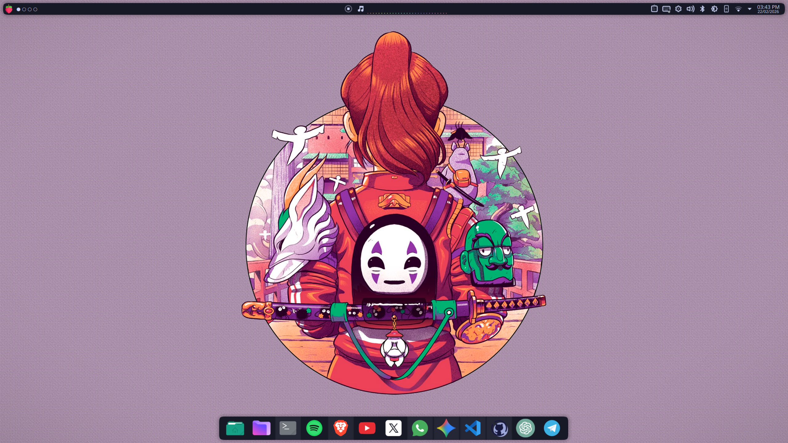
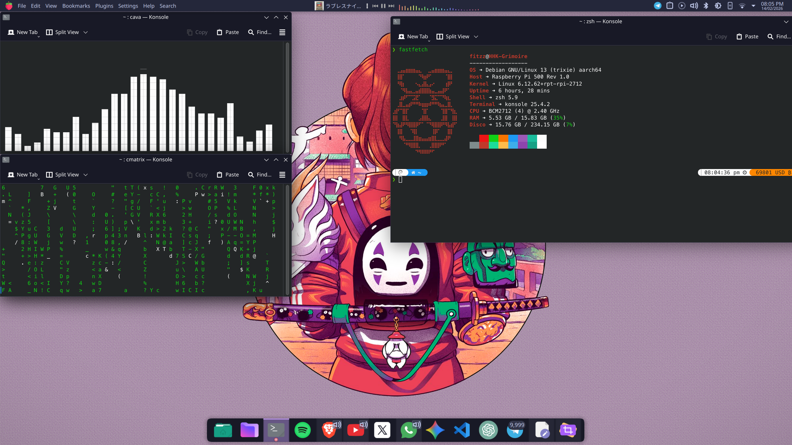
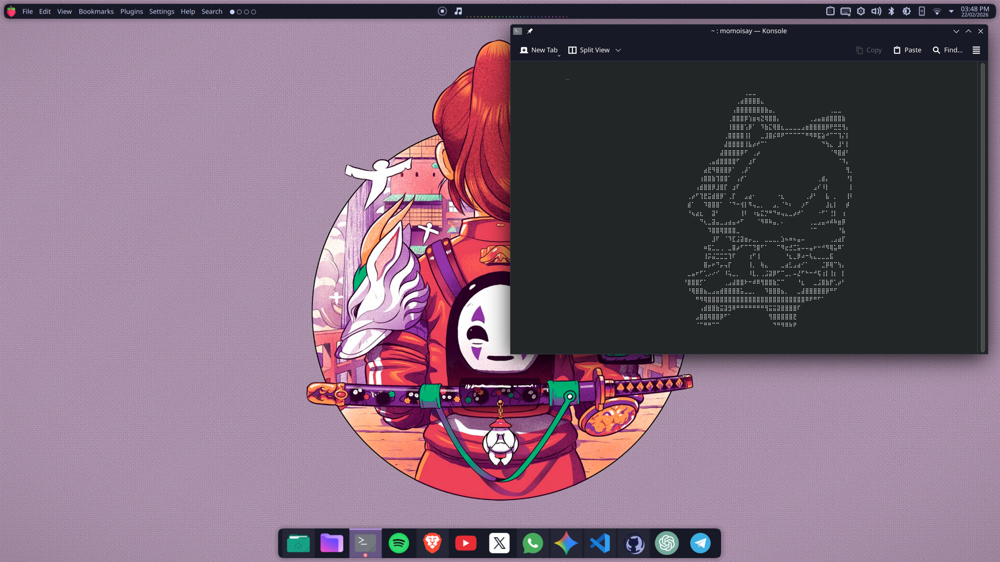

# HHK-Grimoire

My Linux desktop configuration for a Raspberry Pi 500+: Zsh, Powerlevel10k, KDE Plasma shortcuts, a Bitcoin price segment and a small WireGuard helper.

**This is the public edition of my original private HHK-Grimoire repository, which I use to maintain and back up my personal Raspberry Pi workstation.** It documents part of my learning journey with Linux and desktop customization.

The private repository's recorded history begins on **February 22, 2026**. This edition is based on its **March 1, 2026** snapshot, with 18 commits in the source history. The public Git history starts separately so it does not expose the personal email addresses and machine-specific data recorded in the private backup. The date of the first public commit is the publication date of this edition, not the start of the project.

Personal backup automation and private machine data have been removed. The export also includes preparation changes to make the shell and VPN helper more robust; it is not a byte-for-byte mirror. See [PROVENANCE.md](PROVENANCE.md) for the source timeline, snapshot identifier and screenshot checksums. Third-party themes and widgets are credited in [THIRD_PARTY.md](THIRD_PARTY.md).

## My desktop

These are my own screenshots of the original system, retained unchanged from the private repository. They show the original desktop, before preparation of this public edition; the wallpapers and third-party themes are not my artwork.

| Desktop overview | Terminal & Bitcoin | Side workspace |
| --- | --- | --- |
|  |  |  |

## Environment and scope

- Raspberry Pi 500+, ARM64, 16 GB RAM and 256 GB storage.
- Debian 13 (Trixie) with KDE Plasma.
- Zsh with Powerlevel10k and optional shell plugins.
- Ajazz AK820 Pro: `Meta` plus the volume knob switches virtual desktops when the knob emits standard volume keys.

The original configuration was used on this workstation. This public edition has been reviewed statically and tested with isolated command simulations, but has not yet been installed and verified on the Raspberry Pi. The Plasma layout is an optional reference; this is not a universal Linux installer.

## Included customizations

| File | Purpose |
| --- | --- |
| `.zshrc` | Optional shell plugins, portable paths and a Fastfetch logo selector with a fallback |
| `.p10k.zsh` | Rainbow prompt configuration and Bitcoin spot-price segment |
| `scripts/vpn_manager.sh` | Switch between locally stored WireGuard profiles |
| `kde/shortcuts.ini` | The two KDE bindings used for desktop switching with the knob |
| `kde/plasma-org.kde.plasma.desktop-appletsrc.example` | Sanitized panel and widget layout reference |

## Shell setup

Install Zsh, Git, curl and jq using your distribution's package manager. Fastfetch is optional. Follow the official installation instructions for [Powerlevel10k](https://github.com/romkatv/powerlevel10k), including its font recommendation.

This `.zshrc` looks for these optional dependencies at the following locations:

| Dependency | Location |
| --- | --- |
| Powerlevel10k | `~/powerlevel10k/` |
| zsh-autosuggestions | `~/.zsh_plugins/zsh-autosuggestions/` |
| zsh-syntax-highlighting | `~/.zsh_plugins/zsh-syntax-highlighting/` |
| Personal Fastfetch text logos | `${XDG_CONFIG_HOME:-$HOME/.config}/fastfetch/logos/` |

Keep this checkout at `~/HHK-Grimoire`, or set `HHK_GRIMOIRE_DIR` to its actual location. Review the files before applying them. From the checkout directory, the following commands back up the existing shell files before replacing them:

```sh
backup_dir=$(mktemp -d "$HOME/hhk-shell-backup.XXXXXX")
for file in .zshrc .p10k.zsh; do
  if [ -e "$HOME/$file" ]; then
    cp -p "$HOME/$file" "$backup_dir/$file" || exit 1
  fi
done
printf 'Backup saved in: %s\n' "$backup_dir"
cp .zshrc .p10k.zsh "$HOME/"
```

Open a new Zsh session. Missing optional dependencies are skipped. Without custom text logos, Fastfetch uses its default logo. To undo the change, restore the previous files from the printed backup directory; if a file did not previously exist, remove the newly installed copy.

### Bitcoin segment

The prompt requests the public BTC/USD spot price from Coinbase, at most once per minute per shell. Requests have a two-second maximum duration and failures hide the segment. This is a price display, with no account connection, holdings or trading functions. Coinbase receives the normal network request from your connection.

To disable requests, put `export HHK_BITCOIN_ENABLED=0` before the Powerlevel10k loading block in your local `.zshrc`. The fetch is synchronous and can delay a prompt by up to approximately two seconds.

## KDE layout and knob bindings

In KDE System Settings, open Shortcuts and locate the KWin actions for switching one desktop left and right. Assign `Meta+Volume Down` and `Meta+Volume Up`. The original settings are recorded in `kde/shortcuts.ini` for reference. Do not overwrite the complete system shortcut configuration with this two-entry snippet.

The panel example retains references to optional third-party widgets. Install the dependencies described in [THIRD_PARTY.md](THIRD_PARTY.md) before attempting to reproduce it. Choose your own wallpaper, font and application launchers. Back up your existing Plasma configuration and adapt the example for your Plasma version and display arrangement while logged out of Plasma; live configuration replacement can be overwritten by the running desktop.

Complete theme bundles and standalone wallpaper files are not distributed in this edition. The screenshots above document the original system; reproducing its appearance requires installing the credited themes and choosing your own wallpaper separately.

## VPN helper

Install WireGuard and the DNS integration required by your system. Create your own `co.conf`, `ve.conf` and `us.conf` profiles under `/etc/wireguard/`, protected with appropriate root-only permissions. These names are labels; the exit location is determined by the profile you supply. Never add these private files to this repository.

```sh
vpn co
vpn ve
vpn us
vpn off
vpn status
```

The helper requires `sudo`, `wg` and `wg-quick`. It only manages interfaces named `co`, `ve` and `us`, stops on shutdown errors and reports connection failures. It does not implement a kill switch: switching profiles creates a gap, and failed connections may leave normal internet access available. `vpn status` can display peer endpoints and public keys; review its output before sharing a screenshot.

## License

Original contributions are under [MIT](LICENSE). The generated Powerlevel10k configuration is based on upstream work; its license is preserved in [LICENSES/Powerlevel10k.txt](LICENSES/Powerlevel10k.txt). External themes and widgets retain their own licenses and are not included. See [THIRD_PARTY.md](THIRD_PARTY.md).
